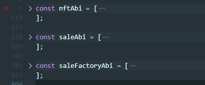
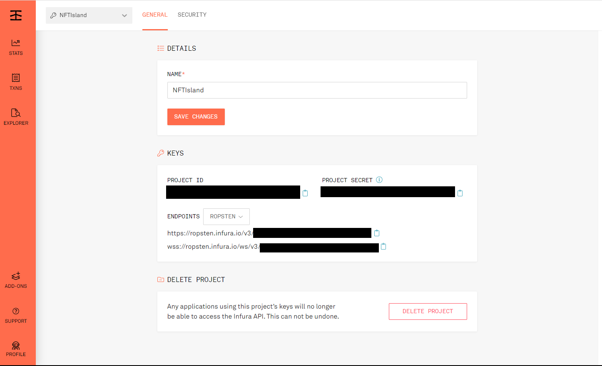
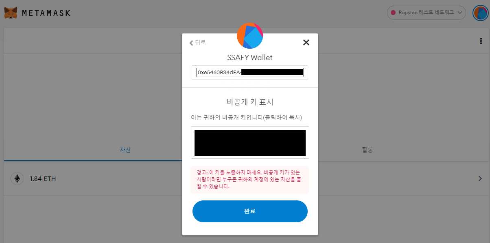

# NFT Island

## 팀원소개

### JIRA 관리자 & 기획 관리 & PM

- 윤은채
- 박준용

### 프론트 테크리더

- 육현동

프론트(육현동, 윤은채, 윤효전)

### 백엔드 테크리더

- 나요셉

백엔드(김길웅, 나요셉, 박준용)

### 스마트 컨트랙트 테크리더

- 김길웅
- 윤효전

스마트컨트랙트(다같이)

### 팀장

- 박준용


## 개발 환경

### Frontend

* React.js 17.0.2
* Material-UI
* Web3.js
* Metamask
* ESLint 8.6.0
* Prettier 2.4.1
* Visual Studio Code


### Backend

* Maven 4.0.0
* Java 11
* Spring-boot 2.4.0
* Spring Data JPA
* QueryDSL
* IntelliJ IDEA


### Smart Contract

* Solidity ^0.8.4
* Truffle
* Ethereum ropsten testnet (deploy)
* Ganache (local test)
* Visual Studio Code


### Database

* Mysql


### Server

* AWS ec2 (Ubuntu 20.04)
* AWS S3
* Nginx
* Docker


### CI/CD

* Jenkins

* GitLab


### Project Magangement

* GitLab
* Mattermost
* Jira
* Notion


## 빌드 및 배포

### 사전 준비

Gitlab에서 git clone 으로 프로젝트 가져오기
```bash
git clone https://lab.ssafy.com/s06-blockchain-nft-sub2/S06P22D107.git
```


### Smart Contract 빌드 및 배포

1. exec 폴더의 '외부 서비스.md' 파일에서 Infura, Metamask 설정을 끝마친다.

2. truffle 설치
   ```bash
   npm install -g truffle
   ```

3. smart-contracts 폴더에서 truffle migrate 실행 (ropsten 네트워크에 배포)
   ```bash
   truffle migrate --network ropsten
   ```

4. 실행 시 콘솔에 나온 NFTIslandBadge와 SaleFactory의 CA(Contract Address) 복사해서 옮겨적어놓기

5. smart-contracts/build/contracts 폴더의 NFTIslandBadge.json과 SaleFactory.json, Sale.json의 ABI 복사해서 옮겨적어놓기

6. 위 CA와 ABI들은 Frontend 배포시에 필요하다.


### Backend 빌드 및 배포

1. MySQL 도커로 실행
   ```bash
   docker run --name mysql \
   -p 3306:3306 \
   -e MYSQL_ROOT_PASSWORD=admin \
   -e MYSQL_DATABASE=nftdb \
   -d mysql \
   --character-set-server=utf8mb4 \
   --collation-server=utf8mb4_unicode_ci
   ```

2. backend/nfti/src/main/resources 폴더의 application.properties 파일에서 mysql 정보 수정
   ```properties
   # 22번째 줄
   spring.datasource.url=jdbc:mysql://localhost:3306/nftdb?useUnicode=true&characterEncoding=utf8&serverTimezone=Asia/Seoul&zeroDateTimeBehavior=convertToNull&rewriteBatchedStatements=true
   
   # 24, 25번째 줄
   spring.datasource.hikari.username=root
   spring.datasource.hikari.password=admin
   ```

3. 같은 파일에서 S3 설정 수정 ('외부 서비스.md' 파일 참고)

4. backend/nfti 폴더에서 프로젝트 빌드
   ```bash
   mvn package
   ```
   
5. backend/nfti/target 폴더에 생성된 nfti-0.0.1-SNAPSHOT.jar 파일을 이용하여 배포

   * 배포 command 예시
     ```bash
     nohup java -jar backend/nfti/target/nfti-0.0.1-SNAPSHOT.jar \
     --server.servlet.context-path=/api \
     --server.address=127.0.0.1 \
     --server.port=8080 \
     >> backend/nfti/logs/nfti-0.0.1-SNAPSHOT.log 2>&1 &
     ```

6. 백그라운드 실행 종료 커맨드를 통해 배포 중지가 가능하다.

   * 배포 중지 command 예시
     ```bash
     kill $(pgrep -f nfti-0.0.1-SNAPSHOT.jar)
     ```


### Frontend 빌드 및 배포

1. frontend 폴더로 이동

   ```bash
   cd frontend
   ```

2. npm install
   ```bash
   npm install
   ```

3. frontend/src/api/http.js 파일의 BASE_URL을 아래와 같이 수정
   ```js
   const BASE_URL = 'http://localhost:8080/v1';
   ```

4. Smart Contract 배포 시 적어놨던 CA와 ABI를 붙여넣어야 한다.
   frontend/src 폴더의 web3Config.js에 해당 값들을 넣는다.
   

5. npm build

   ```bash
   npm run build
   ```

6. 생성된 빌드 폴더에 nginx를 이용하여 포워딩해주면 배포 완료


## 외부 서비스

### Infura

* 이더리움 테스트넷에 배포하기 위해 infura 이용
* infura 가입 후 프로젝트 생성
* 생성된 ropsten endpoint (또는 public key)를 이용해야 함.
* Infura.io 에서 프로젝트 생성 후 설정 접속 사진

  

* 위 사진의 PROJECT ID를 복사하여 S06P22D107/smart-contracts/truffle-config.js 의 69번째 줄,
  {INFURA PUBLIC KEY}에 넣기

  ```js
  // S06P22D107/smart-contracts/truffle-config.js  line:69
  `https://ropsten.infura.io/v3/{INFURA PUBLIC KEY}`
  ```


### Metamask

* 이더리움 테스트넷에 Smart Contract를 배포하기 위해 Metamask 이용

* Metamask 지갑생성 후 해당 지갑의 비공개 키를 이용해야 함.

* Metamask의 비공개 키 조회 사진

  

* 위 사진에서 비공캐 키를 복사하여 S06P22D107/smart-contracts 폴더에 .secret 파일 생성 후 해당 값 입력


### AWS S3

* 파일 저장소 이용을 위해 EC2 서버와 별개로 S3 이용
* AWS 가입 후 S3 버킷 생성
* 버킷 생성 후, S06P22D107/backend/nfti/src/main/resources/appication.properties 의 59~63번 줄에 버킷의 정보들 입력
