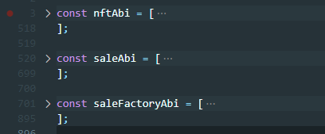

# 빌드 및 배포

### 사전 준비

Gitlab에서 git clone 으로 프로젝트 가져오기
```bash
git clone https://lab.ssafy.com/s06-blockchain-nft-sub2/S06P22D107.git
```


### Smart Contract 빌드 및 배포

1. exec 폴더의 '외부 서비스.md' 파일에서 Infura, Metamask 설정을 끝마친다.

2. truffle 설치
   ```bash
   npm install -g truffle
   ```

3. smart-contracts 폴더에서 truffle migrate 실행 (ropsten 네트워크에 배포)
   ```bash
   truffle migrate --network ropsten
   ```

4. 실행 시 콘솔에 나온 NFTIslandBadge와 SaleFactory의 CA(Contract Address) 복사해서 옮겨적어놓기

5. smart-contracts/build/contracts 폴더의 NFTIslandBadge.json과 SaleFactory.json, Sale.json의 ABI 복사해서 옮겨적어놓기

6. 위 CA와 ABI들은 Frontend 배포시에 필요하다.


### Backend 빌드 및 배포

1. MySQL 도커로 실행
   ```bash
   docker run --name mysql \
   -p 3306:3306 \
   -e MYSQL_ROOT_PASSWORD=admin \
   -e MYSQL_DATABASE=nftdb \
   -d mysql \
   --character-set-server=utf8mb4 \
   --collation-server=utf8mb4_unicode_ci
   ```

2. backend/nfti/src/main/resources 폴더의 application.properties 파일에서 mysql 정보 수정
   ```properties
   # 22번째 줄
   spring.datasource.url=jdbc:mysql://localhost:3306/nftdb?useUnicode=true&characterEncoding=utf8&serverTimezone=Asia/Seoul&zeroDateTimeBehavior=convertToNull&rewriteBatchedStatements=true
   
   # 24, 25번째 줄
   spring.datasource.hikari.username=root
   spring.datasource.hikari.password=admin
   ```

3. 같은 파일에서 S3 설정 수정 ('외부 서비스.md' 파일 참고)

4. backend/nfti 폴더에서 프로젝트 빌드
   ```bash
   mvn package
   ```
   
5. backend/nfti/target 폴더에 생성된 nfti-0.0.1-SNAPSHOT.jar 파일을 이용하여 배포

   * 배포 command 예시
     ```bash
     nohup java -jar backend/nfti/target/nfti-0.0.1-SNAPSHOT.jar \
     --server.servlet.context-path=/api \
     --server.address=127.0.0.1 \
     --server.port=8080 \
     >> backend/nfti/logs/nfti-0.0.1-SNAPSHOT.log 2>&1 &
     ```

6. 백그라운드 실행 종료 커맨드를 통해 배포 중지가 가능하다.

   * 배포 중지 command 예시
     ```bash
     kill $(pgrep -f nfti-0.0.1-SNAPSHOT.jar)
     ```


### Frontend 빌드 및 배포

1. frontend 폴더로 이동

   ```bash
   cd frontend
   ```

2. npm install
   ```bash
   npm install
   ```

3. frontend/src/api/http.js 파일의 BASE_URL을 아래와 같이 수정
   ```js
   const BASE_URL = 'http://localhost:8080/v1';
   ```

4. Smart Contract 배포 시 적어놨던 CA와 ABI를 붙여넣어야 한다.
   frontend/src 폴더의 web3Config.js에 해당 값들을 넣는다.
   
   

5. npm build

   ```bash
   npm run build
   ```

6. 생성된 빌드 폴더에 nginx를 이용하여 포워딩해주면 배포 완료
