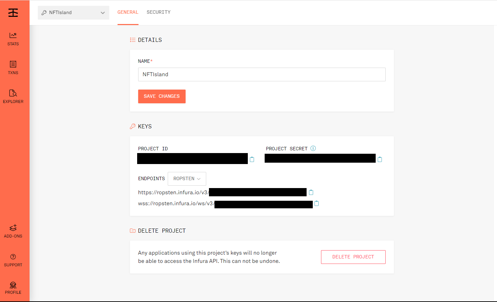
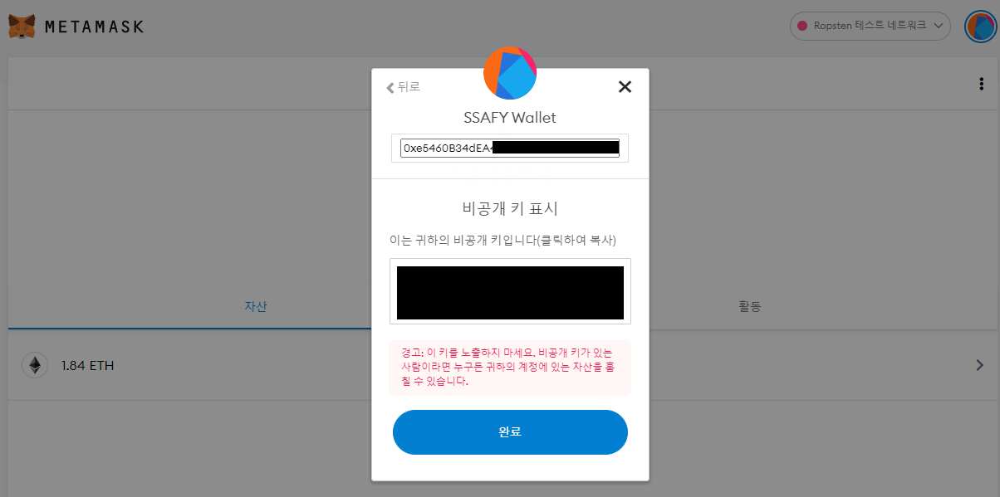

# 외부 서비스

### Infura

* 이더리움 테스트넷에 배포하기 위해 infura 이용
* infura 가입 후 프로젝트 생성
* 생성된 ropsten endpoint (또는 public key)를 이용해야 함.
* Infura.io 에서 프로젝트 생성 후 설정 접속 사진

  

* 위 사진의 PROJECT ID를 복사하여 S06P22D107/smart-contracts/truffle-config.js 의 69번째 줄,
  {INFURA PUBLIC KEY}에 넣기

  ```js
  // S06P22D107/smart-contracts/truffle-config.js  line:69
  `https://ropsten.infura.io/v3/{INFURA PUBLIC KEY}`
  ```


### Metamask

* 이더리움 테스트넷에 Smart Contract를 배포하기 위해 Metamask 이용

* Metamask 지갑생성 후 해당 지갑의 비공개 키를 이용해야 함.

* Metamask의 비공개 키 조회 사진

  

* 위 사진에서 비공캐 키를 복사하여 S06P22D107/smart-contracts 폴더에 .secret 파일 생성 후 해당 값 입력


### AWS S3

* 파일 저장소 이용을 위해 EC2 서버와 별개로 S3 이용
* AWS 가입 후 S3 버킷 생성
* 버킷 생성 후, S06P22D107/backend/nfti/src/main/resources/appication.properties 의 59~63번 줄에 버킷의 정보들 입력
