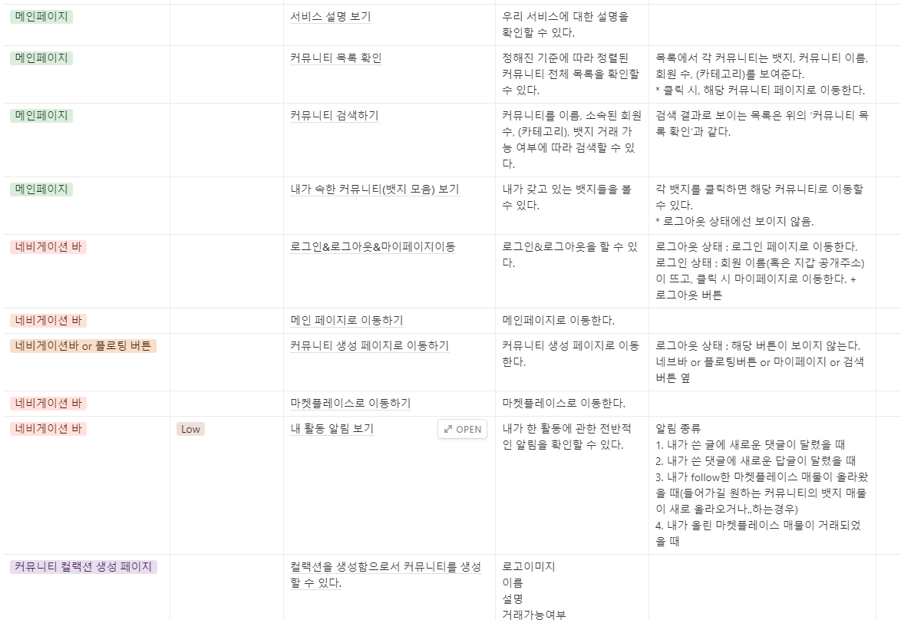
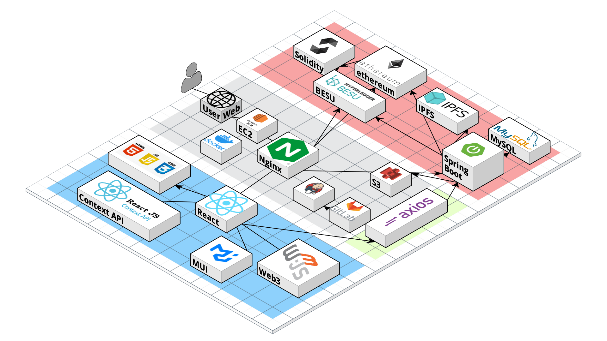
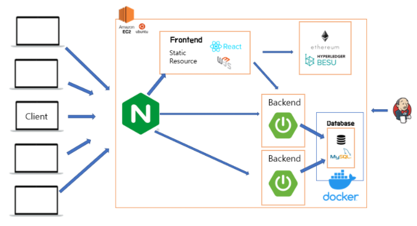
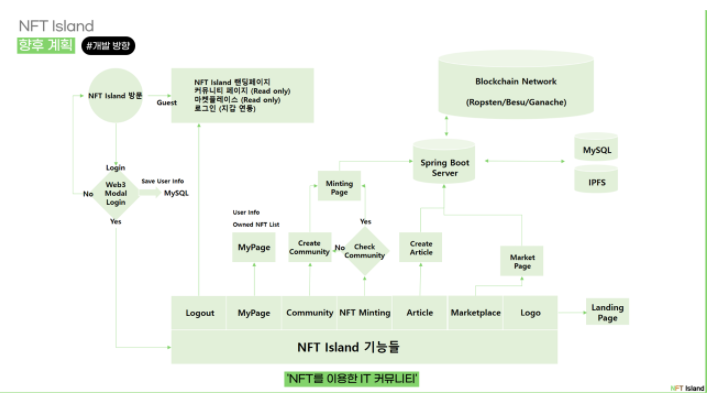
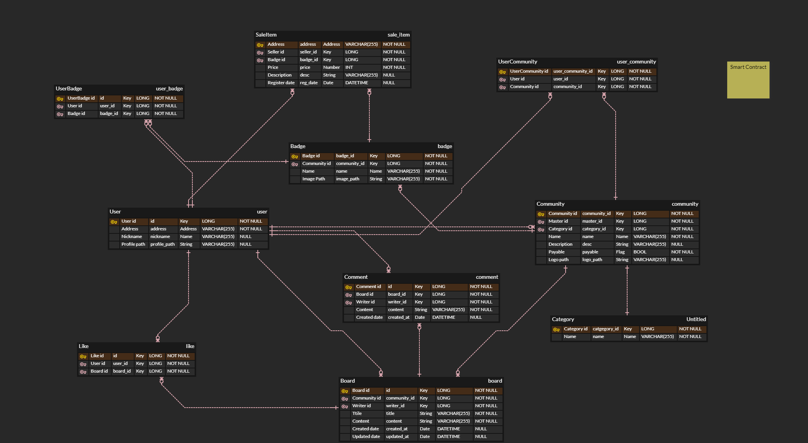
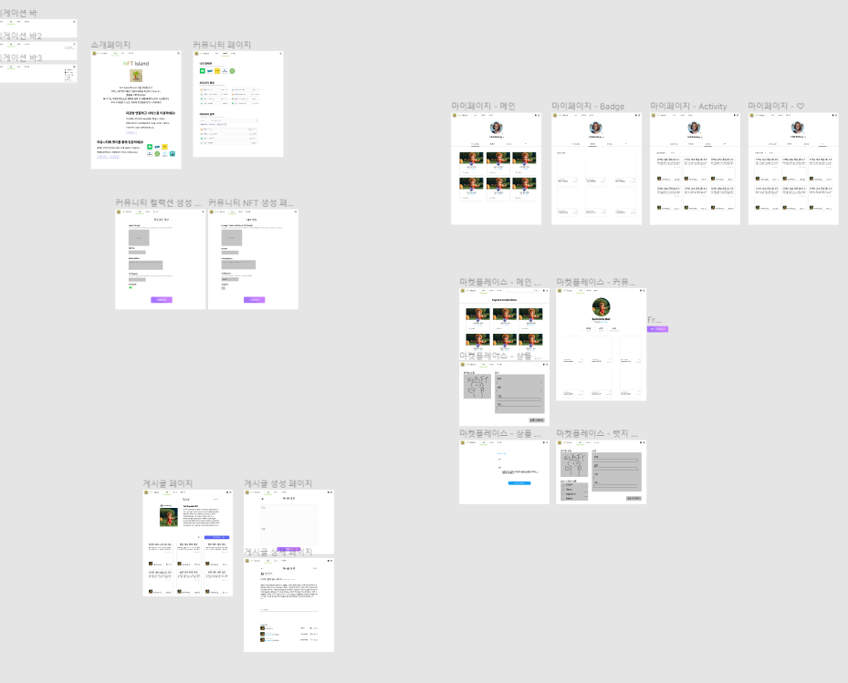
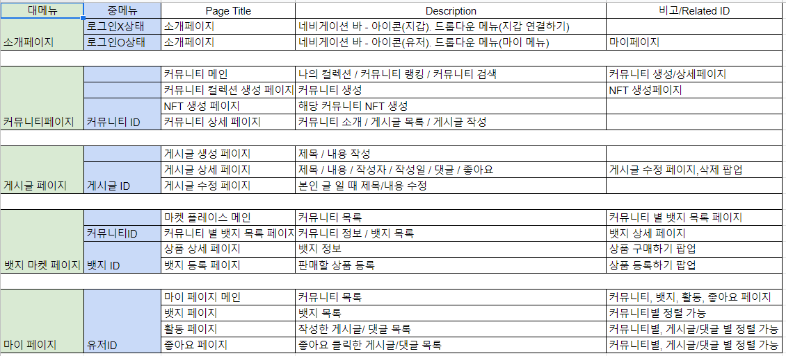
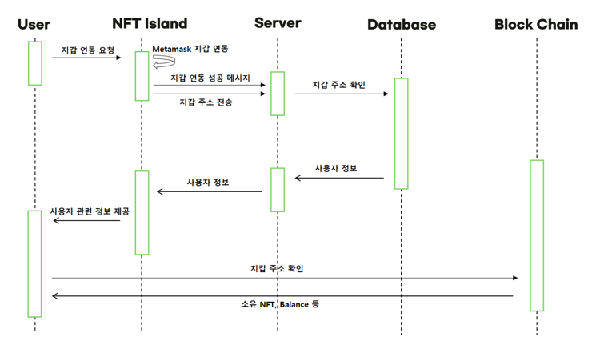
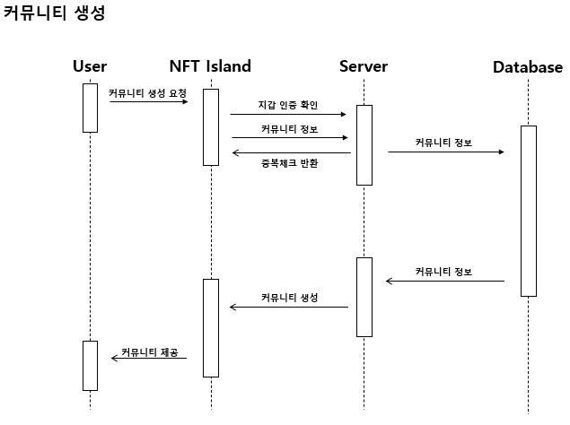
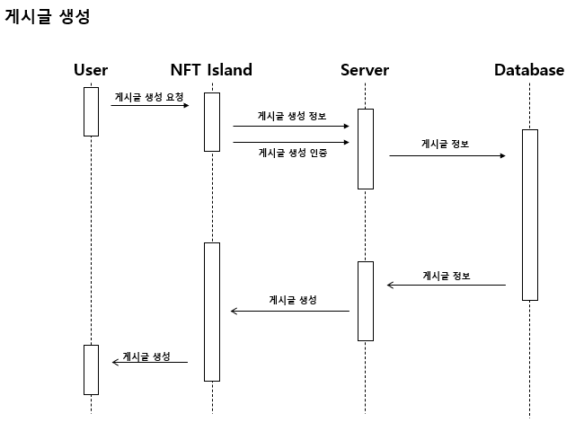

#### 요구사항명세서

https://dev-junyong.notion.site/aa5fcf4d71fe4a88920725a2e9e7077f

#### 기능상세, API 등

https://dev-junyong.notion.site/API-85f85d0305494a368d75de5df1026d83

#### 아키텍쳐 설계

https://dev-junyong.notion.site/9c0b9912a951495c8a2ebf539fdc863e

#### Flow Chart

https://dev-junyong.notion.site/Flow-678253ed90aa44d2908934a8aa2c12d8

#### ERD

https://dev-junyong.notion.site/ERD-448b7daf4a0f4afaab5b6781a4c840a3

#### 와이어프레임

0324 업데이트 완료 / 프로토타입에서 플로우 확인 가능합니다.

https://dev-junyong.notion.site/eb065d74fc2c4750a7473ea75320d8c6

#### 화면 정의서

#### 시퀀스 다이어그램

마켓 플레이스 시퀀스 다이어그램은 명세서 내용과 똑같습니다.